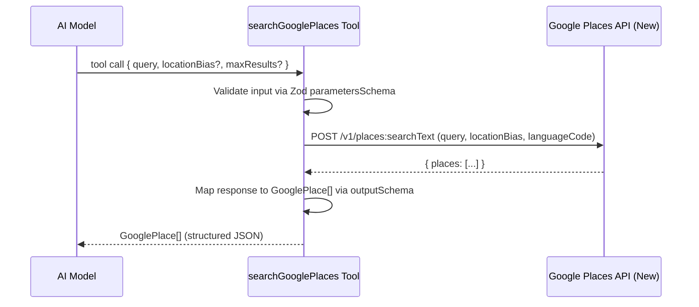

# Design Document: Google Places Tool

## Overview

An LLM tool-callable function that searches the Google Places API (New) Text Search endpoint, accepting a text query and returning structured JSON place objects. Follows the same Vercel AI SDK `tool()` pattern as the existing `calculateItineraryTool`.

## Main Algorithm/Workflow



## Core Interfaces/Types

```typescript
import { z } from 'zod';

// --- Input Schema (what the LLM provides) ---
const SearchGooglePlacesInputSchema = z.object({
  query: z.string().min(1).max(200).describe(
    'Text search query for places, e.g. "best nasi lemak in Melaka" or "museums near Jonker Street"'
  ),
  locationBias: z.object({
    latitude: z.number().min(-90).max(90),
    longitude: z.number().min(-180).max(180),
    radiusMeters: z.number().min(100).max(50000).default(5000),
  }).optional().describe(
    'Optional geographic bias to prefer results near a location'
  ),
  maxResults: z.number().int().min(1).max(10).default(5).describe(
    'Maximum number of places to return (1-10)'
  ),
});

type SearchGooglePlacesInput = z.infer<typeof SearchGooglePlacesInputSchema>;

// --- Output Schema (what the tool returns to the LLM) ---
const GooglePlaceSchema = z.object({
  placeId: z.string(),
  name: z.string(),
  formattedAddress: z.string(),
  location: z.object({
    latitude: z.number(),
    longitude: z.number(),
  }),
  rating: z.number().optional(),
  userRatingCount: z.number().optional(),
  priceLevel: z.enum([
    'PRICE_LEVEL_FREE',
    'PRICE_LEVEL_INEXPENSIVE',
    'PRICE_LEVEL_MODERATE',
    'PRICE_LEVEL_EXPENSIVE',
    'PRICE_LEVEL_VERY_EXPENSIVE',
  ]).optional(),
  types: z.array(z.string()),
  openNow: z.boolean().optional(),
  primaryType: z.string().optional(),
  editorialSummary: z.string().optional(),
});

type GooglePlace = z.infer<typeof GooglePlaceSchema>;
```

## Key Functions with Formal Specifications

### Function 1: searchGooglePlaces (Tool Execute)

```typescript
async function execute(input: SearchGooglePlacesInput): Promise<GooglePlace[]>
```

**Preconditions:**
- `input.query` is a non-empty string (1-200 chars)
- `GOOGLE_PLACES_API_KEY` environment variable is set and non-empty
- If `input.locationBias` provided: latitude ∈ [-90, 90], longitude ∈ [-180, 180], radiusMeters ∈ [100, 50000]
- `input.maxResults` ∈ [1, 10]

**Postconditions:**
- Returns array of `GooglePlace` objects with length ∈ [0, maxResults]
- Each returned place has non-empty `placeId`, `name`, `formattedAddress`
- Each returned place has valid `location.latitude` and `location.longitude`
- If API returns error or no results, returns empty array (never throws to LLM)
- No mutation of input parameters

**Loop Invariants:** N/A (single API call, map over results)

### Function 2: buildRequestBody

```typescript
function buildRequestBody(input: SearchGooglePlacesInput): GooglePlacesTextSearchRequest
```

**Preconditions:**
- `input` passes Zod validation

**Postconditions:**
- Returns well-formed request body for Google Places Text Search (New) API
- `textQuery` field equals `input.query`
- `maxResultCount` field equals `input.maxResults`
- `languageCode` is set to `"ms"` (Malay) for hyperlocal Malaysian context
- If `locationBias` provided, includes `locationBias.circle` in request body
- Includes `includedType` field only if not provided (allows broad search)

**Loop Invariants:** N/A

### Function 3: mapPlaceResponse

```typescript
function mapPlaceResponse(apiPlace: GooglePlacesAPIPlace): GooglePlace
```

**Preconditions:**
- `apiPlace` is a raw place object from Google Places API response
- `apiPlace.id` exists (Google always returns place ID)

**Postconditions:**
- Returns `GooglePlace` matching the output schema
- Maps `apiPlace.displayName.text` → `name`
- Maps `apiPlace.id` → `placeId`
- Maps `apiPlace.formattedAddress` → `formattedAddress`
- Maps `apiPlace.location` → `location`
- Optional fields (`rating`, `priceLevel`, `openNow`, `editorialSummary`) are included only if present in API response
- `types` defaults to empty array if not present

**Loop Invariants:** N/A

## Algorithmic Pseudocode

### Main Tool Execution Algorithm

```typescript
// Inside the tool's execute function
async function execute(input: SearchGooglePlacesInput): Promise<GooglePlace[]> {
  // Step 1: Retrieve API key from environment
  const apiKey = process.env.GOOGLE_PLACES_API_KEY;
  if (!apiKey) {
    console.error('GOOGLE_PLACES_API_KEY not configured');
    return []; // Graceful degradation — don't crash the LLM flow
  }

  // Step 2: Build the request body
  const requestBody = buildRequestBody(input);

  // Step 3: Call Google Places Text Search (New) API
  const response = await fetch(
    'https://places.googleapis.com/v1/places:searchText',
    {
      method: 'POST',
      headers: {
        'Content-Type': 'application/json',
        'X-Goog-Api-Key': apiKey,
        'X-Goog-FieldMask': [
          'places.id',
          'places.displayName',
          'places.formattedAddress',
          'places.location',
          'places.rating',
          'places.userRatingCount',
          'places.priceLevel',
          'places.types',
          'places.currentOpeningHours',
          'places.primaryType',
          'places.editorialSummary',
        ].join(','),
      },
      body: JSON.stringify(requestBody),
    }
  );

  // Step 4: Handle API errors gracefully
  if (!response.ok) {
    console.error(`Google Places API error: ${response.status} ${response.statusText}`);
    return [];
  }

  const data = await response.json();

  // Step 5: Map and validate results
  const places: GooglePlace[] = (data.places ?? [])
    .slice(0, input.maxResults)
    .map(mapPlaceResponse);

  return places;
}
```

### Request Body Builder

```typescript
function buildRequestBody(input: SearchGooglePlacesInput) {
  const body: Record<string, unknown> = {
    textQuery: input.query,
    maxResultCount: input.maxResults,
    languageCode: 'ms', // Malaysian Malay for hyperlocal results
  };

  if (input.locationBias) {
    body.locationBias = {
      circle: {
        center: {
          latitude: input.locationBias.latitude,
          longitude: input.locationBias.longitude,
        },
        radius: input.locationBias.radiusMeters,
      },
    };
  }

  return body;
}
```

### Response Mapper

```typescript
function mapPlaceResponse(apiPlace: Record<string, unknown>): GooglePlace {
  return {
    placeId: apiPlace.id as string,
    name: (apiPlace.displayName as { text: string })?.text ?? 'Unknown',
    formattedAddress: (apiPlace.formattedAddress as string) ?? '',
    location: {
      latitude: (apiPlace.location as { latitude: number }).latitude,
      longitude: (apiPlace.location as { latitude: number; longitude: number }).longitude,
    },
    rating: apiPlace.rating as number | undefined,
    userRatingCount: apiPlace.userRatingCount as number | undefined,
    priceLevel: apiPlace.priceLevel as GooglePlace['priceLevel'],
    types: (apiPlace.types as string[]) ?? [],
    openNow: (apiPlace.currentOpeningHours as { openNow?: boolean })?.openNow,
    primaryType: apiPlace.primaryType as string | undefined,
    editorialSummary: (apiPlace.editorialSummary as { text?: string })?.text,
  };
}
```

## Example Usage

```typescript
import { tool } from 'ai';
import { z } from 'zod';

// Tool definition (in lib/tools/search-google-places.ts)
export const searchGooglePlacesTool = tool({
  description:
    'Search for places in Malaysia using Google Places API. ' +
    'Returns structured place data including name, address, location, ' +
    'rating, and price level. Use this to find restaurants, attractions, ' +
    'and activities for the itinerary.',

  parameters: SearchGooglePlacesInputSchema,

  execute: async (input) => {
    // ... implementation as described above
  },
});

// Usage in route handler (app/api/generate-deck/route.ts or similar)
import { generateText } from 'ai';
import { openai } from '@ai-sdk/openai';
import { searchGooglePlacesTool } from '@/lib/tools/search-google-places';

const result = await generateText({
  model: openai('gpt-4o'),
  tools: {
    search_google_places: searchGooglePlacesTool,
    calculate_itinerary: calculateItineraryTool,
  },
  maxSteps: 5,
  prompt: 'Find the best food spots in Melaka for a day trip...',
});
```

## Correctness Properties

```typescript
// Property 1: Output length never exceeds maxResults
// ∀ input, output: output.length <= input.maxResults

// Property 2: Every returned place has required fields
// ∀ place ∈ output: place.placeId !== '' ∧ place.name !== '' ∧ place.formattedAddress !== ''

// Property 3: Location coordinates are valid
// ∀ place ∈ output: place.location.latitude ∈ [-90, 90] ∧ place.location.longitude ∈ [-180, 180]

// Property 4: Tool never throws — always returns array (possibly empty)
// ∀ input, apiState: execute(input) resolves to GooglePlace[] (never rejects)

// Property 5: Empty query is rejected at schema level
// ∀ input where input.query === '': Zod validation fails before execute runs

// Property 6: API key absence results in empty array, not crash
// Given GOOGLE_PLACES_API_KEY is undefined: execute(validInput) → []
```
