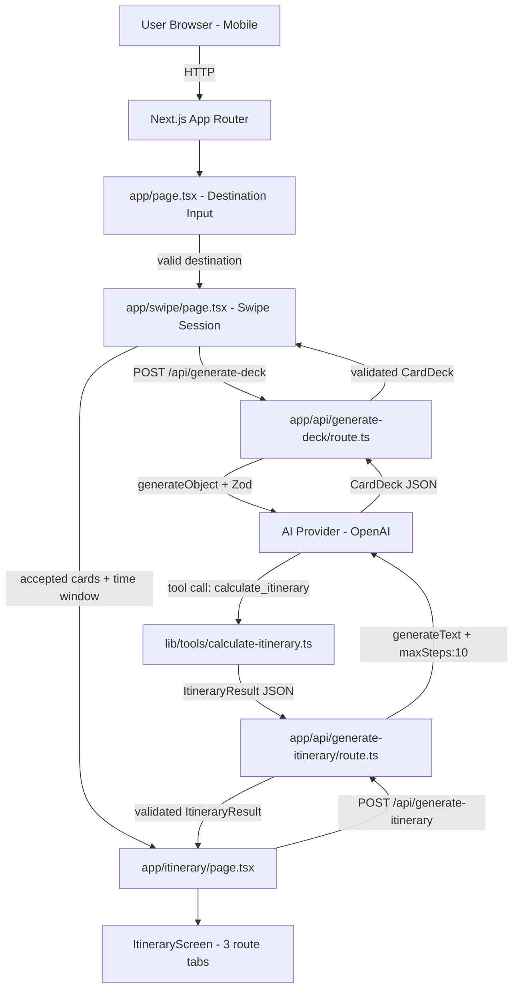

# Design Document: MY Buddy Itinerary Planner

## Overview

MY Buddy is a mobile-first, hyperlocal AI itinerary planner for Malaysia. The application guides users through a Tinder-style card-swiping session to capture preferences, then uses those signals to generate a personalised day-trip itinerary with three distinct route variants (Optimized, Makan-Focused, Santai).

The core design philosophy is:
- **AI-first**: The AI generates all card content and itinerary logic; the app is a thin orchestration layer.
- **Mobile-first**: Every screen is designed for 320px–428px viewports with touch-native interactions.
- **Hyperlocal**: Tone, timing, and cultural references are distinctly Malaysian throughout.
- **Correctness by construction**: All AI outputs are validated through Zod schemas before use; the `calculate_itinerary` tool enforces deterministic math for Human Error Buffers and priority-based card dropping.

### Key Design Decisions

1. **Vercel AI SDK `generateObject` for Card Deck generation** — enforces structured JSON output directly from the LLM, eliminating the need for post-hoc parsing. The Zod schema is passed as the `schema` parameter, giving the model a JSON Schema contract to satisfy.

2. **`calculate_itinerary` as a Vercel AI SDK Tool** — the itinerary engine is implemented as a server-side tool called via `generateText` with `maxSteps: 10`. This allows the AI to iteratively recalculate the schedule (dropping cards, adjusting buffers) across multiple tool-call roundtrips until the itinerary fits the time window.

3. **Framer Motion for swipe gestures** — `framer-motion`'s `drag` and `dragConstraints` APIs provide smooth, physics-based card drag with directional detection, working natively on both iOS Safari and Android Chrome without additional gesture libraries.

4. **Client-side swipe state, server-side itinerary logic** — swipe decisions are held in React state on the client; the accepted card list is sent to a Next.js Route Handler that invokes the AI SDK tool. This keeps sensitive AI API keys server-side.

5. **Three-route generation in a single AI call** — all three route variants (Optimized, Makan-Focused, Santai) are generated in one `generateText` call with `maxSteps: 10`, returning a structured JSON object containing all three variants. This avoids three separate API calls and keeps the itinerary internally consistent.

---

## Architecture



### Request Flow Summary

1. User enters destination → validated client-side and server-side against Recognised Location List.
2. `POST /api/generate-deck` → `generateObject` call returns a validated `CardDeck`.
3. User swipes through cards → accepted cards accumulated in React state.
4. `POST /api/generate-itinerary` → `generateText` with `maxSteps: 10` invokes `calculate_itinerary` tool iteratively until all three route variants fit the time window.
5. Validated `ItineraryResult` returned to client → displayed as three scrollable route tabs.

---

## Components and Interfaces

### Page Components (`app/`)

| Component | Route | Responsibility |
|---|---|---|
| `DestinationInputPage` | `/` | Destination field, validation, transition to swipe |
| `SwipeSessionPage` | `/swipe` | Card deck display, swipe gesture handling, accepted card accumulation |
| `ItineraryPage` | `/itinerary` | Three-route tab display, activity schedule rendering |

### Feature Components (`components/`)

| Component | Description |
|---|---|
| `DestinationInput` | Controlled input with inline validation messages, Malaysian-English error copy |
| `TimeWindowInput` | Arrival/departure HH:MM pickers with 30-minute gap validation |
| `SwipeCard` | Single card with Framer Motion drag, directional overlay (green/red), card content |
| `SwipeCardStack` | Manages card deck state, renders top 2 cards for depth effect |
| `SwipeControls` | Left/right button controls below the card stack (44×44px minimum touch targets) |
| `LoadingIndicator` | Malaysian-English loading messages with slang rotation |
| `RouteTabBar` | Three-tab selector for Optimized / Makan-Focused / Santai |
| `ActivitySchedule` | Time-ordered list of activities with start time, buffered duration, location, price |
| `ErrorMessage` | Reusable inline error with retry button |

### API Route Handlers (`app/api/`)

#### `POST /api/generate-deck`

**Request body:**
```typescript
{ destination: string }
```

**Response body:**
```typescript
{ deck: CardDeck } | { error: string }
```

**Logic:**
1. Validate `destination` against `RECOGNISED_LOCATIONS` list.
2. Call `generateObject({ model, schema: CardDeckSchema, prompt })` with Malaysian-English system prompt.
3. Validate result against `CardDeckSchema` (Zod).
4. If any card fails validation, retry that card up to 3 times.
5. If minimum card counts not met after retries, return `{ error }`.

#### `POST /api/generate-itinerary`

**Request body:**
```typescript
{
  acceptedCards: Card[];
  arrivalTime: string;   // HH:MM
  departureTime: string; // HH:MM
  destination: string;
}
```

**Response body:**
```typescript
{ itinerary: ItineraryResult } | { error: string }
```

**Logic:**
1. Validate time window (departure − arrival ≥ 30 minutes).
2. Call `generateText({ model, tools: { calculate_itinerary }, maxSteps: 10, prompt })`.
3. The AI invokes `calculate_itinerary` tool one or more times to produce all three route variants.
4. Parse final tool result through `ItineraryResultSchema` (Zod).
5. Return validated result or error.

### Tool Definition (`lib/tools/`)

#### `calculate_itinerary` Tool

```typescript
// lib/tools/calculate-itinerary.ts
import { tool } from 'ai';
import { z } from 'zod';

export const calculateItineraryTool = tool({
  description: 'Calculate a time-ordered itinerary from accepted activity cards...',
  parameters: z.object({
    cards: z.array(ActivityCardSchema),
    arrivalTime: z.string(),   // HH:MM
    departureTime: z.string(), // HH:MM
    bufferMultiplier: z.number().default(1.25),
    routeType: z.enum(['optimized', 'makan-focused', 'santai']),
  }),
  execute: async (input) => {
    // 1. Compute bufferedDuration for each card
    // 2. Check total fits time window
    // 3. Drop Low → Medium priority cards (longest first) until it fits
    // 4. Order activities per routeType rules
    // 5. Assign start/end times
    // 6. Return ScheduledItinerary
  },
});
```

The tool is **pure TypeScript** — no external API calls. The AI calls it up to `maxSteps` times, each time receiving the tool result and deciding whether to call it again with adjusted parameters (e.g., after the AI determines the Santai route needs a different card set).

---

## Data Models

All schemas are defined in `lib/schemas.ts` and shared between client and server.

### `CardSchema` (Zod)

```typescript
export const CardSchema = z.object({
  id: z.string().uuid(),
  type: z.enum(['activity', 'question']),
  title: z.string().min(1).max(100),
  description: z.string().min(1).max(300),
  // Activity-only fields (optional on question cards)
  location: z.string().min(1).max(100).optional(),
  baseDuration: z.number().int().positive().max(720).optional(), // minutes
  price: z.string().regex(/^(Free|RM\s?\d+(\s?[–-]\s?RM?\s?\d+)?)$/).optional(),
  priority: z.enum(['High', 'Medium', 'Low']).optional(),
  category: z.enum(['Food', 'Culture', 'Nature', 'Shopping', 'Entertainment', 'Other']).optional(),
});

export type Card = z.infer<typeof CardSchema>;

// Narrowed type for activity cards (used in itinerary engine)
export const ActivityCardSchema = CardSchema.extend({
  type: z.literal('activity'),
  location: z.string().min(1).max(100),
  baseDuration: z.number().int().positive().max(720),
  price: z.string().regex(/^(Free|RM\s?\d+(\s?[–-]\s?RM?\s?\d+)?)$/),
  priority: z.enum(['High', 'Medium', 'Low']),
  category: z.enum(['Food', 'Culture', 'Nature', 'Shopping', 'Entertainment', 'Other']),
});

export type ActivityCard = z.infer<typeof ActivityCardSchema>;
```

### `CardDeckSchema` (Zod)

```typescript
export const CardDeckSchema = z.object({
  destination: z.string(),
  cards: z.array(CardSchema).min(8).max(15),
}).refine(
  (deck) => deck.cards.filter(c => c.type === 'question').length >= 3,
  { message: 'Deck must contain at least 3 Clarifying Question Cards' }
).refine(
  (deck) => deck.cards.filter(c => c.type === 'activity').length >= 4,
  { message: 'Deck must contain at least 4 Activity Cards' }
);

export type CardDeck = z.infer<typeof CardDeckSchema>;
```

### `ScheduledActivitySchema` (Zod)

```typescript
export const ScheduledActivitySchema = z.object({
  cardTitle: z.string(),
  location: z.string(),
  price: z.string(),
  priority: z.enum(['High', 'Medium', 'Low']),
  startTime: z.string().regex(/^\d{2}:\d{2}$/),  // HH:MM
  endTime: z.string().regex(/^\d{2}:\d{2}$/),    // HH:MM
  bufferedDuration: z.number().int().positive(),  // minutes
  isRestInterval: z.boolean().default(false),     // Santai rest slots
});

export type ScheduledActivity = z.infer<typeof ScheduledActivitySchema>;
```

### `RouteItinerarySchema` (Zod)

```typescript
export const RouteItinerarySchema = z.object({
  route: z.enum(['optimized', 'makan-focused', 'santai']),
  activities: z.array(ScheduledActivitySchema).min(1).max(20),
  totalDuration: z.number().int().positive().max(1440), // minutes
  droppedCards: z.array(z.string()).default([]),         // titles of dropped cards
  warningMessage: z.string().optional(),                 // shown when cards were dropped
});

export type RouteItinerary = z.infer<typeof RouteItinerarySchema>;
```

### `ItineraryResultSchema` (Zod)

```typescript
export const ItineraryResultSchema = z.object({
  destination: z.string(),
  arrivalTime: z.string().regex(/^\d{2}:\d{2}$/),
  departureTime: z.string().regex(/^\d{2}:\d{2}$/),
  routes: z.tuple([
    RouteItinerarySchema,
    RouteItinerarySchema,
    RouteItinerarySchema,
  ]),
});

export type ItineraryResult = z.infer<typeof ItineraryResultSchema>;
```

### `SwipeSessionState` (Client-side React state)

```typescript
interface SwipeSessionState {
  deck: CardDeck | null;
  currentIndex: number;
  acceptedCards: Card[];
  answers: Record<string, 'Yes' | 'No'>; // questionText → answer
  status: 'idle' | 'loading' | 'swiping' | 'complete' | 'error';
  errorMessage: string | null;
}
```

### `TimeWindowState` (Client-side React state)

```typescript
interface TimeWindowState {
  arrivalTime: string;    // HH:MM, default "09:00"
  departureTime: string;  // HH:MM, default "18:00"
  validationError: string | null;
}
```

### Recognised Location List

```typescript
// lib/locations.ts
export const RECOGNISED_LOCATIONS: string[] = [
  'Melaka', 'Malacca',
  'Kuala Lumpur', 'KL',
  'Penang', 'George Town',
  'Johor Bahru', 'JB',
  'Ipoh',
  'Kota Kinabalu',
  'Kuching',
  'Shah Alam',
  'Petaling Jaya',
  'Subang Jaya',
  // ... expandable list
];

export function isRecognisedLocation(input: string): boolean {
  const normalised = input.trim().toLowerCase();
  return RECOGNISED_LOCATIONS.some(loc => loc.toLowerCase() === normalised);
}
```

---

## Itinerary Engine Logic

The `calculate_itinerary` tool implements the following deterministic algorithm:

### Step 1: Compute Buffered Durations

```
bufferedDuration = ceil(baseDuration × multiplier / 5) × 5
```

- Optimized / Makan-Focused: `multiplier = 1.25`
- Santai: `multiplier = 1.30`
- Rounding: up to nearest 5 minutes

### Step 2: Check Time Window Fit

```
availableMinutes = departureTime − arrivalTime (in minutes)
totalRequired = sum(bufferedDuration for all activity cards)
               + (santaiRestIntervals × 15 if Santai route)
```

### Step 3: Priority-Based Card Dropping

If `totalRequired > availableMinutes`:
1. Sort cards by priority tier: Low → Medium → High (never drop High).
2. Within each tier, sort by `bufferedDuration` descending (drop longest first).
3. Drop cards one at a time, recalculating `totalRequired` after each drop.
4. Stop when `totalRequired ≤ availableMinutes` or only High-priority cards remain.
5. If High-priority cards alone still exceed the window, return a partial itinerary with a warning.

### Step 4: Route-Specific Ordering

**Optimized Route:**
- Order activities to minimise total road distance (nearest-neighbour heuristic on location strings; for MVP, use a fixed ordering based on geographic zones within the destination city).
- Tie-break: higher priority card goes earlier.

**Makan-Focused Route:**
- Identify Food-category cards.
- Slot breakfast Food card into 07:00–09:00 window if available.
- Slot lunch Food card into 12:00–14:00 window if available.
- Slot dinner Food card into 18:00–21:00 window if available.
- Fill remaining slots with non-food cards ordered by priority.
- If no Food card available for a meal window, fill with highest-priority non-food card that fits.

**Santai Route:**
- Apply 1.30× buffer to all cards.
- Insert 15-minute rest intervals between every consecutive pair of activities.
- Drop lowest-priority cards if total exceeds time window.

### Step 5: Assign Start/End Times

Walk through the ordered activity list, assigning:
```
activity[0].startTime = arrivalTime
activity[0].endTime = arrivalTime + bufferedDuration[0]
activity[n].startTime = activity[n-1].endTime + restInterval (0 for non-Santai)
activity[n].endTime = activity[n].startTime + bufferedDuration[n]
```

---

## Swipe Gesture Implementation

The `SwipeCard` component uses Framer Motion's `motion.div` with drag constraints:

```typescript
// Simplified gesture logic
const SWIPE_THRESHOLD = 100; // px

<motion.div
  drag="x"
  dragConstraints={{ left: 0, right: 0 }}
  onDrag={(_, info) => {
    // Show directional overlay based on info.offset.x
    setOverlayDirection(info.offset.x > 0 ? 'right' : 'left');
  }}
  onDragEnd={(_, info) => {
    if (info.offset.x > SWIPE_THRESHOLD) handleSwipeRight();
    else if (info.offset.x < -SWIPE_THRESHOLD) handleSwipeLeft();
    else setOverlayDirection(null); // snap back
  }}
/>
```

- Overlay appears during drag; removed within 300ms of gesture end via Framer Motion `animate` transition.
- Button controls call `handleSwipeRight()` / `handleSwipeLeft()` directly, bypassing gesture detection.
- Swipe response target: ≤100ms from gesture start to overlay appearance (Framer Motion runs on the main thread with `useTransform` for zero-latency visual feedback).

---

## Error Handling

| Scenario | Handling |
|---|---|
| Empty / whitespace destination | Inline validation message; field retained |
| Unrecognised destination | Inline Malaysian-English error; submitted value retained |
| AI deck generation failure (all 3 attempts) | Loading indicator removed; error message + retry button |
| Card fails Zod validation | Discard card; request replacement (up to 3 attempts per card) |
| Minimum card counts not met after retries | User-facing error + retry deck button |
| Fewer than 2 accepted cards at session end | Encouraging message + restart swipe session button |
| Itinerary Zod parse failure | Log error; retry after 2s delay; up to 2 additional retries |
| All Zod retries exhausted | User-facing error message (no duplicate error log) |
| High-priority cards alone exceed time window | Partial itinerary + warning message to user |
| AI text lacks Malaysian cultural references | Re-prompt up to 3 times; display as-is with warning log if still fails |
| Landscape reflow fails to prevent horizontal scroll | Allow horizontal scroll as fallback (do not clip content) |

### Error Message Tone

All user-facing error messages use Malaysian-English tone. Examples:
- Destination not found: *"Alamak, we don't recognise that place lah! Try 'Melaka', 'Penang', or 'KL' — we're expanding soon, boleh?"*
- Deck generation failure: *"Aiyoh, something went wrong generating your cards. Jom try again?"*
- Too few accepted cards: *"Eh, swipe a few more lah! We need at least 2 cards to plan your trip."*

---

## Testing Strategy

### Unit Tests

Focus on deterministic, pure-function logic:

- `calculateBufferedDuration(baseDuration, multiplier)` — rounding to nearest 5 minutes
- `dropCardsToFitWindow(cards, availableMinutes)` — priority ordering and dropping logic
- `assignStartEndTimes(orderedCards, arrivalTime, restInterval)` — time arithmetic
- `isRecognisedLocation(input)` — case-insensitive matching
- `validateTimeWindow(arrival, departure)` — 30-minute gap enforcement
- Zod schema parse/reject cases for `CardSchema`, `CardDeckSchema`, `ItineraryResultSchema`

### Property-Based Tests

Use **fast-check** (TypeScript-native PBT library) with a minimum of **100 iterations** per property.

Each property test is tagged with:
`// Feature: my-buddy-itinerary-planner, Property {N}: {property_text}`

See Correctness Properties section for the full list of properties to implement.

### Integration Tests

- `POST /api/generate-deck` with a valid destination returns a `CardDeck` matching `CardDeckSchema`
- `POST /api/generate-itinerary` with valid accepted cards returns an `ItineraryResult` matching `ItineraryResultSchema`
- Zod retry logic: mock AI to return invalid JSON on first call, valid on second

### Snapshot / UI Tests

- `SwipeCard` renders correctly at 320px and 428px viewport widths
- `ActivitySchedule` renders all required fields (start time, buffered duration, location, price)
- `RouteTabBar` highlights the selected tab

### Manual / Device Tests

- iOS Safari (two most recent major versions) — swipe gesture, landscape reflow
- Android Chrome (two most recent major versions) — swipe gesture, landscape reflow
- Lighthouse mobile performance score ≥ 70 on Itinerary screen


---

## Correctness Properties

*A property is a characteristic or behavior that should hold true across all valid executions of a system — essentially, a formal statement about what the system should do. Properties serve as the bridge between human-readable specifications and machine-verifiable correctness guarantees.*

The properties below are derived from the acceptance criteria in `requirements.md`. Each is universally quantified and suitable for implementation as a property-based test using **fast-check** (TypeScript PBT library) with a minimum of 100 iterations.

---

### Property 1: Destination Validation is Exhaustive

*For any* string input, the destination validation function SHALL accept it if and only if it matches an entry in the Recognised Location List (case-insensitive) AND contains between 1 and 100 non-whitespace characters; it SHALL reject all other strings, including empty strings and whitespace-only strings.

**Validates: Requirements 1.2, 1.3, 1.4**

---

### Property 2: Card Deck Size and Composition Invariant

*For any* valid `CardDeck` produced by the system, the deck SHALL contain between 8 and 15 cards (inclusive), at least 3 of which have `type === 'question'` and at least 4 of which have `type === 'activity'`.

**Validates: Requirements 2.1, 2.2**

---

### Property 3: Activity Card Field Completeness

*For any* `ActivityCard` in a generated `CardDeck`, all five required fields (`title`, `location`, `baseDuration`, `price`, `priority`) SHALL be present, non-null, and individually satisfy their type and range constraints (title 1–100 chars, baseDuration positive integer ≤ 720, price matching the Free/RM pattern, priority one of High/Medium/Low).

**Validates: Requirements 2.3, 9.1**

---

### Property 4: Malaysian Slang Presence in Card Descriptions

*For any* `Card` in a generated `CardDeck`, the card's `description` field SHALL contain at least one term from the set {"Lepak", "Ngam", "On-the-way", "Makan", "Santai", "Shiok", "Boleh"} (case-insensitive match).

**Validates: Requirements 2.7, 7.2**

---

### Property 5: Swipe Outcome Correctness

*For any* card at any position in a card deck, performing a right-swipe action (gesture or button click) SHALL result in that card being present in `acceptedCards` and `currentIndex` advancing by exactly 1; performing a left-swipe action SHALL result in that card being absent from `acceptedCards` and `currentIndex` advancing by exactly 1.

**Validates: Requirements 3.2, 3.3, 3.5**

---

### Property 6: Clarifying Question Answer Recording

*For any* `Clarifying Question Card`, swiping right SHALL record `answers[card.title] === 'Yes'` and swiping left SHALL record `answers[card.title] === 'No'`, with the association persisting unchanged for the remainder of the session.

**Validates: Requirements 3.6, 3.7**

---

### Property 7: Human Error Buffer Calculation

*For any* `baseDuration` value in the range [1, 720] minutes and any buffer multiplier in {1.25, 1.30}, the computed `bufferedDuration` SHALL equal `Math.ceil((baseDuration × multiplier) / 5) × 5` — that is, the product rounded up to the nearest 5 minutes.

**Validates: Requirements 4.2, 5.4**

---

### Property 8: Priority-Based Card Dropping Invariant

*For any* set of `ActivityCard` objects and any available time window (in minutes), when the total `bufferedDuration` exceeds the window, the card-dropping algorithm SHALL: (a) never drop a High-priority card, (b) drop all Low-priority cards before dropping any Medium-priority card, and (c) within the same priority tier, drop the card with the longest `bufferedDuration` first; the resulting card set SHALL have a total `bufferedDuration` that fits within the available time window, or consist solely of High-priority cards if no fitting subset exists.

**Validates: Requirements 4.4, 4.5, 5.5**

---

### Property 9: Itinerary Output Schema Validity

*For any* valid input to the `calculate_itinerary` tool (any set of accepted cards and any valid time window), the produced `ItineraryResult` SHALL parse successfully through `ItineraryResultSchema` without throwing a Zod validation error, and the parsed object SHALL be deeply equal to the pre-parse value.

**Validates: Requirements 4.6, 9.2**

---

### Property 10: Three Route Variants Always Present

*For any* valid accepted card set and time window with a gap of at least 30 minutes, the `ItineraryResult` SHALL contain exactly 3 route objects with `route` values of `'optimized'`, `'makan-focused'`, and `'santai'` respectively, each containing at least 1 scheduled activity.

**Validates: Requirements 5.1**

---

### Property 11: Makan-Focused Food Scheduling

*For any* accepted card set containing at least one `ActivityCard` with `category === 'Food'`, the Makan-Focused route SHALL schedule that card such that its `startTime` falls within one of the designated meal windows: breakfast (07:00–09:00), lunch (12:00–14:00), or dinner (18:00–21:00).

**Validates: Requirements 5.3**

---

### Property 12: Santai Route Rest Interval Invariant

*For any* Santai route output containing 2 or more scheduled activities, the gap between the `endTime` of each activity and the `startTime` of the immediately following activity SHALL be exactly 15 minutes, and each activity's `bufferedDuration` SHALL equal `Math.ceil((baseDuration × 1.30) / 5) × 5`.

**Validates: Requirements 5.4**

---

### Property 13: Time Window Validation

*For any* pair of time strings `(arrivalTime, departureTime)`, the time window validation function SHALL return an error if `arrivalTime >= departureTime` OR if the difference `departureTime − arrivalTime` is less than 30 minutes; it SHALL return success only when `departureTime − arrivalTime >= 30 minutes`.

**Validates: Requirements 6.3, 6.4**

---

### Property 14: Time Window Boundary Preservation

*For any* valid `(arrivalTime, departureTime)` pair with a gap of at least 30 minutes, the `calculate_itinerary` tool SHALL receive exactly those time values as its `arrivalTime` and `departureTime` parameters — no truncation, rounding, or timezone conversion applied.

**Validates: Requirements 6.5**

---

### Property 15: Card Data Round-Trip Integrity

*For any* `Card` object with valid field values, serialising the card to JSON via `JSON.stringify` and deserialising via `JSON.parse` SHALL produce an object whose `title`, `location`, `baseDuration`, `price`, and `priority` fields are strictly equal (`===`) to those of the original card object.

**Validates: Requirements 10.1, 10.2, 10.3**

---

### Property 16: Zod Schema Round-Trip for Cards and Itineraries

*For any* object that satisfies the structural shape of `CardSchema` or `ItineraryResultSchema`, parsing it through the corresponding Zod schema SHALL succeed and return an object that is deeply equal to the input; *for any* object that violates any field constraint (wrong type, out-of-range value, missing required field), the parse SHALL throw a `ZodError`.

**Validates: Requirements 9.1, 9.2**

